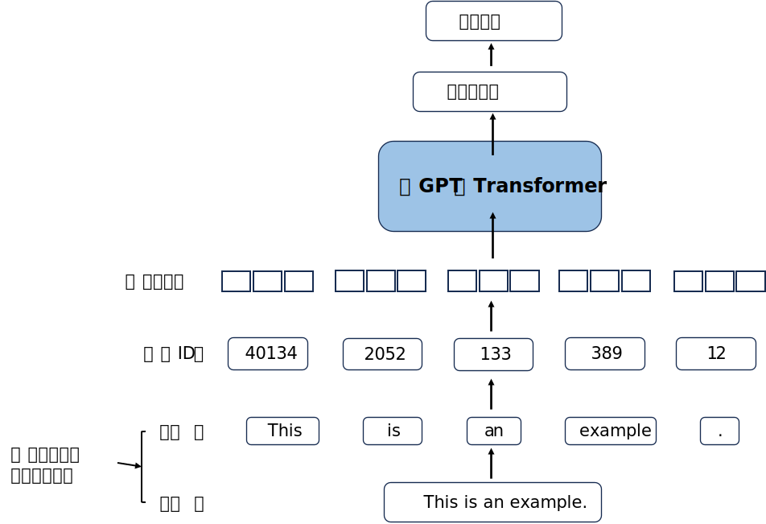

```python
import mindspore
# mindspore.set_context(device_target='CPU')
# mindspore.set_context(device_target='GPU')
mindspore.set_context(device_target="Ascend")
mindspore.set_context(device_id=0)
mindspore.run_check()
```

    MindSpore version:  2.1.0
    The result of multiplication calculation is correct, MindSpore has been installed on platform [Ascend] successfully!


# 2 处理文本数据

在大语言模型（LLM）的开发过程中，数据准备是至关重要的一步。本章将详细介绍如何对文本数据进行处理，包括分词、词元化、词嵌入等关键技术，为后续的模型训练打下坚实基础。


## 2.1 理解词嵌入

- 词嵌入（Word Embedding）是将词语映射到连续向量空间的技术，能够捕捉词语之间的语义关系。

- 我们能够对各种数据类型进行嵌入处理，包括视频、音频以及文本。本书只关注文本数据的嵌入。


- 词嵌入能够捕捉词语之间的语义关系，使得语义相似的词在向量空间中的距离较近。

- 词嵌入是LLM处理文本数据的基础，通过它，模型才能理解和生成人类语言。

- 词向量可以拥有从一维到数千维的不同维度。下图展示了二维的情况。在实际应用中，词嵌入通常是高维的，以捕捉更丰富的语义信息。


## 2.2 分词

- 分词是将连续文本分解为离散单元的过程，这些离散单元称为词元(tokens)。

- 对文本进行分词，即将文本分割成单独的词元，词元可以是单个单词、字符或子词单元。

- 分词是将人类语言转换为机器可理解格式的第一步，也是后续处理的基础。

- 不同的语言和应用场景可能需要不同的分词策略。



- 加载原始文本，以短篇小说The Verdict为例。这是我们将要处理的示例文本。


```python
import os
import urllib.request

if not os.path.exists("the-verdict.txt"):
    url = ("https://raw.githubusercontent.com/Miao109/"
            "llm_mindspore/refs/heads/main/the-verdict.txt")
    file_path = "the-verdict.txt"
    urllib.request.urlretrieve(url, file_path)
```


```python
with open("the-verdict.txt", "r", encoding="utf-8") as f:
    raw_text = f.read()
    
print("Total number of character:", len(raw_text))
print(raw_text[:99])
```

    Total number of character: 20479
    I HAD always thought Jack Gisburn rather a cheap genius--though a good fellow enough--so it was no 


- 本节的目标是将这个包含 20,479 个字符的短篇小说分解成单个单词和特殊字符，这样模型才能处理这些信息。

- 开发一个简单的分词器：首先尝试根据空白字符拆分文本，这是最基本的分词方法之一。


```python
import re 
text = "Hello, world. This, is a test." 
result = re.split(r'(\s)', text)
print(result)
```

    ['Hello,', ' ', 'world.', ' ', 'This,', ' ', 'is', ' ', 'a', ' ', 'test.']


这种简单的分词方案可以将示例文本拆分为单个单词；但是，可以看到有一些单词仍然与标点符号连在一起，我们希望将单词与标点符号分开，使它们作为列表中的单独元素。


```python
result = re.split(r'([,.]|\s)', text) 
print(result)
```

    ['Hello', ',', '', ' ', 'world', '.', '', ' ', 'This', ',', '', ' ', 'is', ' ', 'a', ' ', 'test', '.', '']


可以看到，上述分词结果中列表中还有一些空白字符，这些往往是不必要的。我们可以通过过滤方法移除这些空白字符，进一步净化分词结果。


```python
result = [item for item in result if item.strip()] 
print(result)
```

    ['Hello', ',', 'world', '.', 'This', ',', 'is', 'a', 'test', '.']


为了处理更复杂的文本，我们还需要对其他类型的标点符号进行同样的处理，比如问号、破折号等。下面的代码展示了如何处理更多种类的标点符号。


```python
text = "Hello, world. Is this-- a test?" 
result = re.split(r'([,.:;?_!"()\']|--|\s)', text) 
result = [item.strip() for item in result if item.strip()] 
print(result)
```

    ['Hello', ',', 'world', '.', 'Is', 'this', '--', 'a', 'test', '?']


现在，让我们将这种分词方法应用到伊迪丝·华顿的整个短篇小说上，看看效果如何。


```python
preprocessed = re.split(r'([,.:;?_!"()\']|--|\s)', raw_text) 
preprocessed = [item.strip() for item in preprocessed if item.strip()] 
print(len(preprocessed))
```

    4690


```python
print(preprocessed[:30])
```

    ['I', 'HAD', 'always', 'thought', 'Jack', 'Gisburn', 'rather', 'a', 'cheap', 'genius', '--', 'though', 'a', 'good', 'fellow', 'enough', '--', 'so', 'it', 'was', 'no', 'great', 'surprise', 'to', 'me', 'to', 'hear', 'that', ',', 'in']


## 2.3 用词元ID表示词元

在完成分词后，下一步是将这些词元从字符串形式转换为整数形式，即生成词元ID。这是词元到嵌入向量转换过程的中间步骤，也是模型能够处理文本的关键环节。


首先，我们需要构建一个包含所有词元并按字母顺序排列的词汇表。这个词汇表将作为从词元到整数ID的映射基础。


```python
all_words = sorted(set(preprocessed)) 
vocab_size = len(all_words) 
print(vocab_size)
```

    1130


```python
vocab = {token:integer for integer,token in enumerate(all_words)} 
for i, item in enumerate(vocab.items()): 
    print(item) 
    if i >= 50: 
        break
```

    ('!', 0)
    ('"', 1)
    ("'", 2)
    ('(', 3)
    (')', 4)
    (',', 5)
    ('--', 6)
    ('.', 7)
    (':', 8)
    (';', 9)
    ('?', 10)
    ('A', 11)
    ('Ah', 12)
    ('Among', 13)
    ('And', 14)
    ('Are', 15)
    ('Arrt', 16)
    ('As', 17)
    ('At', 18)
    ('Be', 19)
    ('Begin', 20)
    ('Burlington', 21)
    ('But', 22)
    ('By', 23)
    ('Carlo', 24)
    ('Chicago', 25)
    ('Claude', 26)
    ('Come', 27)
    ('Croft', 28)
    ('Destroyed', 29)
    ('Devonshire', 30)
    ('Don', 31)
    ('Dubarry', 32)
    ('Emperors', 33)
    ('Florence', 34)
    ('For', 35)
    ('Gallery', 36)
    ('Gideon', 37)
    ('Gisburn', 38)
    ('Gisburns', 39)
    ('Grafton', 40)
    ('Greek', 41)
    ('Grindle', 42)
    ('Grindles', 43)
    ('HAD', 44)
    ('Had', 45)
    ('Hang', 46)
    ('Has', 47)
    ('He', 48)
    ('Her', 49)
    ('Hermia', 50)


使用现有的词汇表将新文本转换为词元ID。通过这种方式，我们可以将任意文本转换为模型可以处理的数字序列。


为了方便使用，我们将这些代码整合成一个分词器类，该类可以实现文本到词元ID的转换，以及从词元ID返回到文本的解码功能。


```python
class SimpleTokenizerV1: 
    def __init__(self, vocab): 
        self.str_to_int = vocab 
        self.int_to_str = {i:s for s,i in vocab.items()} 
    def encode(self, text): 
        preprocessed = re.split(r'([,.?_!"()\']|--|\s)', text) 
        preprocessed = [ 
            item.strip() for item in preprocessed if item.strip() 
        ] 
        ids = [self.str_to_int[s] for s in preprocessed] 
        return ids 
    def decode(self, ids): 
        text = " ".join([self.int_to_str[i] for i in ids]) 
        text = re.sub(r'\s+([,.?!"()\'])', r'\1', text) 
        return text
```

`encode`函数将文本编码为词元ID序列，`decode`函数则将词元ID序列解码回文本。这两个函数是分词器的核心功能。


现在，让我们使用SimpleTokenizerV1类实例化一个新的分词器对象，并对短篇小说"the-verdict.txt"中的一段文字进行分词处理，看看效果如何：


```python
tokenizer = SimpleTokenizerV1(vocab) 
text = """"It's the last he painted, you know," 
            Mrs. Gisburn said with pardonable pride.""" 
ids = tokenizer.encode(text) 
print(ids)
```

    [1, 56, 2, 850, 988, 602, 533, 746, 5, 1126, 596, 5, 1, 67, 7, 38, 851, 1108, 754, 793, 7]


将这些整数值转换回文本，验证我们的分词器是否能够正确地进行编码和解码操作。


```python
print(tokenizer.decode(ids))
```

    " It' s the last he painted, you know," Mrs. Gisburn said with pardonable pride.


```python
tokenizer.decode(tokenizer.encode(text))
```


    '" It\' s the last he painted, you know," Mrs. Gisburn said with pardonable pride.'


## 2.4 添加特殊上下文词元

为了增强模型对文本中上下文或其他相关信息的理解，我们需要添加一些特殊上下文词元。这些特殊词元具有特定的功能和含义：

- `<|unk|>`：用于表示未知单词，即词汇表中不存在的词。

- `<|endoftext|>`：用于表示文档的结束或文本的边界，帮助模型识别不同文本之间的分隔。


基于不同的LLM架构和应用需求，研究人员可能还会考虑其他一些特殊词元：
- `[BOS]`（beginning of sequence）—— 用于表示文档的开始，以便模型能够识别输入何时开始。
- `[EOS]`（end  of sequence）—— 用于标明输入序列的结束，在将多个不相关的文本连接起来时特别有用，这一点与 <|endoftext|> 标记类似。例如，在合并两篇不同的维基百科文章或书籍时，
- `[EOS]` 标记表明一篇内容在哪里结束以及下一篇从哪里开始。> 
- `[PAD]`（padding）—— 当训练LLM时所用的批次大小大于 1时，批次中可能包含长度各异的文本。为确保所有文本长度相同，会使用 [PAD] 对较短的文本进行“填充”。

在实际应用中，我们经常在不相关的文本之间添加<|endoftext|>特殊词元，以清晰地标记文本边界。


让我们尝试将之前构建的分词器应用于一段新文本，看看会发生什么：


```python
text = "Hello, do you like tea?" 
print(tokenizer.encode(text))
```


    ---------------------------------------------------------------------------

    KeyError                                  Traceback (most recent call last)

    /tmp/ipykernel_34572/1160838860.py in <module>
          1 text = "Hello, do you like tea?"
    ----> 2 print(tokenizer.encode(text))
    

    /tmp/ipykernel_34572/3975630850.py in encode(self, text)
          8             item.strip() for item in preprocessed if item.strip()
          9         ] 
    ---> 10         ids = [self.str_to_int[s] for s in preprocessed]
         11         return ids
         12     def decode(self, ids):


    /tmp/ipykernel_34572/3975630850.py in <listcomp>(.0)
          8             item.strip() for item in preprocessed if item.strip()
          9         ] 
    ---> 10         ids = [self.str_to_int[s] for s in preprocessed]
         11         return ids
         12     def decode(self, ids):


    KeyError: 'Hello'


我们发现当分词器遇到词汇表中不存在的单词（如"Hello"）时会抛出错误。这说明我们需要改进分词器，使其能够处理未知词。

为此，我们将两个特殊词元`<|unk|>`和`<|endoftext|>`添加到词汇表中，用于处理这些特殊情况。


```python
all_tokens = sorted(list(set(preprocessed))) 
all_tokens.extend(["<|endoftext|>", "<|unk|>"]) 
vocab = {token:integer for integer,token in enumerate(all_tokens)} 
```


```python
print(len(vocab.items()))
```

    1132


```python
for i, item in enumerate(list(vocab.items())[-5:]): 
    print(item)
```

    ('younger', 1127)
    ('your', 1128)
    ('yourself', 1129)
    ('<|endoftext|>', 1130)
    ('<|unk|>', 1131)


接下来，我们对分词器进行相应的调整，使其能够正确处理未知词和文本边界。


```python
class SimpleTokenizerV2: 
    def __init__(self, vocab): 
        self.str_to_int = vocab 
        self.int_to_str = { i:s for s,i in vocab.items()} 
    def encode(self, text): 
        preprocessed = re.split(r'([,.:;?_!"()\']|--|\s)', text) 
        preprocessed = [ 
            item.strip() for item in preprocessed if item.strip() 
        ] 
        preprocessed = [item if item in self.str_to_int 
        else "<|unk|>" for item in preprocessed] 
        ids = [self.str_to_int[s] for s in preprocessed] 
        return ids 
    def decode(self, ids): 
        text = " ".join([self.int_to_str[i] for i in ids]) 
        text = re.sub(r'\s+([,.:;?!"()\'])', r'\1', text) 
        return text
```

现在让我们使用改进后的分词器处理包含特殊词元的文本：


```python
text1 = "Hello, do you like tea?" 
text2 = "In the sunlit terraces of the palace." 
text = " <|endoftext|> ".join((text1, text2)) 
print(text)
```

    Hello, do you like tea? <|endoftext|> In the sunlit terraces of the palace.


```python
tokenizer = SimpleTokenizerV2(vocab) 
print(tokenizer.encode(text))
```

    [1131, 5, 355, 1126, 628, 975, 10, 1130, 55, 988, 956, 984, 722, 988, 1131, 7]


```python
print(tokenizer.decode(tokenizer.encode(text)))
```

    <|unk|>, do you like tea? <|endoftext|> In the sunlit terraces of the <|unk|>.


## 2.5 字节对编码

现在我们来介绍一种更先进、更复杂的分词方案——字节对编码（BPE）。BPE最初是作为一种文本压缩算法开发的，后来被OpenAI在预训练GPT系列模型时广泛采用作为分词器的核心算法，包括GPT-2、GPT-3以及ChatGPT等。

BPE的主要优势在于它能够有效地处理未登录词（OOV）问题，同时保持词汇表规模合理。它通过将常见的词保持完整，同时将罕见词分解为子词单元的方式实现这一点。

由于BPE的实现过程相对复杂，我们将借助现有的Python开源库——"[transformers](https://github.com/huggingface/transformers)"或"tiktoken"来进行相关操作。


```python
from transformers import GPT2Tokenizer
# 指定本地词汇表文件所在的目录路径
local_path = "./gpt2-tokenizer"

# 从本地路径加载GPT - 2分词器
tokenizer = GPT2Tokenizer.from_pretrained(local_path)
```


```python
text = ( 
    "Hello, do you like tea? <|endoftext|> In the sunlit terraces" 
    "of someunknownPlace." 
) 
integers = tokenizer.encode(text, allowed_special={"<|endoftext|>"}) 
print(integers)
```

    Keyword arguments {'allowed_special': {'<|endoftext|>'}} not recognized.


    [15496, 11, 466, 345, 588, 8887, 30, 220, 50256, 554, 262, 4252, 18250, 8812, 2114, 1659, 617, 34680, 27271, 13]


```python
strings = tokenizer.decode(integers) 
print(strings)
```

    Hello, do you like tea? <|endoftext|> In the sunlit terracesof someunknownPlace.


BPE分词器的一个重要特性是能够处理未知词。下面我们将看到它是如何处理含有未知词的文本的：


与我们之前实现的简单分词器不同，基于BPE算法的分词器在处理未知单词时，不会简单地将其标记为`<|unk|>`，而是会将其分解为子词单元或字符序列，这使得模型能够对未见过的词汇保持一定程度的理解能力。

## 2.6 数据采样：滑动窗口

在准备好分词器后，下一步是为模型训练准备适当的数据格式。LLM主要通过预测文本中的下一个词元来进行预训练，因此我们需要将文本数据组织成一系列的输入-目标对，其中目标是输入序列中的下一个词元。

滑动窗口是一种常用的数据采样方法，它通过在文本上滑动固定大小的窗口来创建这些输入-目标对。


首先，我们使用分词器对整个文本进行编码，得到词元ID序列：


```python
with open("the-verdict.txt", "r", encoding="utf-8") as f:
    raw_text = f.read()

enc_text = tokenizer.encode(raw_text)
print(len(enc_text))
```

    Token indices sequence length is longer than the specified maximum sequence length for this model (5145 > 1024). Running this sequence through the model will result in indexing errors


    5145


通过滑动窗口方法，我们可以从预处理后的文本中提取大量样本，得到一系列的输入-目标对。由于语言模型的核心任务是预测下一个词元，所以目标是输入向右偏移一个位置后对应的词元。

下面演示如何使用滑动窗口创建简单的输入-目标对：


```python
enc_sample = enc_text[50:]
```


```python
context_size = 4

x = enc_sample[:context_size]
y = enc_sample[1:context_size+1]

print(f"x: {x}")
print(f"y:      {y}")
```

    x: [290, 4920, 2241, 287]
    y:      [4920, 2241, 287, 257]


```python
for i in range(1, context_size+1):
    context = enc_sample[:i]
    desired = enc_sample[i]

    print(context, "---->", desired)
```

    [290] ----> 4920
    [290, 4920] ----> 2241
    [290, 4920, 2241] ----> 287
    [290, 4920, 2241, 287] ----> 257


为了更清楚地理解输入和目标之间的关系，我们可以将词元ID解码为实际文本：


```python
for i in range(1, context_size+1): 
    context = enc_sample[:i] 
    desired = enc_sample[i] 
    print(tokenizer.decode(context), "---->", tokenizer.decode([desired]))
```

     and ---->  established
     and established ---->  himself
     and established himself ---->  in
     and established himself in ---->  a


在模型训练之前，我们需要一个高效的数据加载器来批量处理这些输入-目标对。这个数据加载器将遍历数据集，并以MindSpore张量的形式返回批量的输入数据和目标数据。


以下代码实现了一个专门用于GPT模型的数据加载器，它使用滑动窗口方法进行数据采样：


```python
from mindspore.dataset import GeneratorDataset
from mindspore import Tensor
class GPTDatasetV1:
    def __init__(self, txt, tokenizer, max_length, stride):
        self.input_ids = []
        self.target_ids = []

        # Tokenize the entire text
        token_ids = tokenizer.encode(txt, allowed_special={"<|endoftext|>"})
        # Use a sliding window to chunk the book into overlapping sequences of max_length
        for i in range(0, len(token_ids) - max_length, stride):
            input_chunk = token_ids[i:i + max_length]
            target_chunk = token_ids[i + 1: i + max_length + 1]
            self.input_ids.append(Tensor(input_chunk))
            self.target_ids.append(Tensor(target_chunk))
    def __getitem__(self, idx):
        return self.input_ids[idx], self.target_ids[idx]
    def __len__(self):
        return len(self.input_ids)
```

接下来，创建一个辅助函数来初始化和配置数据加载器：


```python
def create_dataloader_v1(txt, batch_size=4, max_length=256, 
                         stride=128, shuffle=True, drop_last=True,
                         num_workers=0):
    # 指定本地词汇表文件所在的目录路径
    local_path = "./gpt2-tokenizer"

    # 从本地路径加载GPT - 2分词器
    tokenizer = GPT2Tokenizer.from_pretrained(local_path)
    # Create dataset
    dataset = GPTDatasetV1(txt, tokenizer, max_length, stride)
    dataloader = GeneratorDataset(dataset, ["input_ids", "target_ids"], shuffle=shuffle)
    dataloader = dataloader.batch(batch_size, drop_remainder=drop_last)
    return dataloader
```

设定batch大小为1，上下位大小为4，来测试我们的数据加载器：


```python
with open("the-verdict.txt", "r", encoding="utf-8") as f: 
    raw_text = f.read() 
```


```python
dataloader = create_dataloader_v1( 
    raw_text, batch_size=1, max_length=4, stride=1, shuffle=False) 
data_iter = iter(dataloader) 
first_batch = next(data_iter) 
print(first_batch)
```

    Keyword arguments {'allowed_special': {'<|endoftext|>'}} not recognized.
    Token indices sequence length is longer than the specified maximum sequence length for this model (5145 > 1024). Running this sequence through the model will result in indexing errors


    [Tensor(shape=[1, 4], dtype=Int64, value=
    [[  40,  367, 2885, 1464]]), Tensor(shape=[1, 4], dtype=Int64, value=
    [[ 367, 2885, 1464, 1807]])]


```python
second_batch = next(data_iter) 
print(second_batch)
```

    [Tensor(shape=[1, 4], dtype=Int64, value=
    [[ 367, 2885, 1464, 1807]]), Tensor(shape=[1, 4], dtype=Int64, value=
    [[2885, 1464, 1807, 3619]])]


可以看到，stride的值决定了输入在不同批次间偏移的位置量，从而实现了滑动窗口方法。较小的stride值会产生更多的重叠样本，而较大的stride值则会减少重叠，但也会减少样本总数。


```python
dataloader = create_dataloader_v1(raw_text, batch_size=8, max_length=4, stride=4, shuffle=False)

data_iter = iter(dataloader)
inputs, targets = next(data_iter)
print("Inputs:\n", inputs)
print("\nTargets:\n", targets)
```

    Keyword arguments {'allowed_special': {'<|endoftext|>'}} not recognized.
    Token indices sequence length is longer than the specified maximum sequence length for this model (5145 > 1024). Running this sequence through the model will result in indexing errors


    Inputs:
     [[   40   367  2885  1464]
     [ 1807  3619   402   271]
     [10899  2138   257  7026]
     [15632   438  2016   257]
     [  922  5891  1576   438]
     [  568   340   373   645]
     [ 1049  5975   284   502]
     [  284  3285   326    11]]
    
    Targets:
     [[  367  2885  1464  1807]
     [ 3619   402   271 10899]
     [ 2138   257  7026 15632]
     [  438  2016   257   922]
     [ 5891  1576   438   568]
     [  340   373   645  1049]
     [ 5975   284   502   284]
     [ 3285   326    11   287]]


## 2.7 词嵌入

在完成分词和数据采样后，下一步是将词元ID转换为嵌入向量。词嵌入是一种将离散符号（如词元ID）映射到连续向量空间的技术，这使得模型能够捕捉词元之间的语义关系。


我们可以使用MindSpore的nn.Embedding层来实现词嵌入。假设有以下4个词元ID：2、3、5、1，我们将演示如何将它们转换为嵌入向量。


```python
input_ids = Tensor([2, 3, 5, 1])
```

为简单起见，假设我们的词汇表仅包含6个单词，并设定嵌入向量的维度为3。在实际应用中，词汇表通常有上万甚至数十万个词元，嵌入维度也会更高。


```python
import mindspore
from mindspore import nn
```


```python
vocab_size = 6
output_dim = 3

mindspore.set_seed(123)
embedding_layer = nn.Embedding(vocab_size, output_dim)
```


```python
print(embedding_layer.embedding_table)
```

    Parameter (name=embedding_table, shape=(6, 3), dtype=Float32, requires_grad=True)


```python
embedding_layer.embedding_table.asnumpy()
```


    array([[-0.01257949, -0.00093973,  0.01836986],
           [-0.00773198,  0.00244677, -0.00437232],
           [-0.00352256,  0.00886481,  0.00904443],
           [ 0.0110456 ,  0.00728295, -0.00120312],
           [ 0.01376666,  0.0001967 , -0.00284691],
           [ 0.00700223, -0.0051715 , -0.00239952]], dtype=float32)


嵌入层的权重矩阵最初是由随机值构成的。在LLM训练过程中，这些权重会作为模型参数进行优化，最终学习到有意义的语义表示。

给定词元ID为3，我们可以使用嵌入层将其转换为对应的嵌入向量：


```python
print(embedding_layer(Tensor([3])))
```

    [[ 0.0110456   0.00728295 -0.00120312]]


现在，我们将嵌入层应用到一个词元ID序列上，得到一个嵌入向量序列：


```python
print(embedding_layer(input_ids))
```

    [[-0.00352256  0.00886481  0.00904443]
     [ 0.0110456   0.00728295 -0.00120312]
     [ 0.00700223 -0.0051715  -0.00239952]
     [-0.00773198  0.00244677 -0.00437232]]


嵌入层实质上是一种查找操作：它根据词元ID从嵌入矩阵中检索对应的向量行。这个过程非常高效，是深度学习中处理文本数据的基础操作。


## 2.8 单词位置编码

在上一节中，我们介绍了如何将词元转换为嵌入向量，但这些嵌入向量不包含词元在序列中的位置信息。在处理序列数据时，词元的位置往往包含重要的语义信息，例如"猫追狗"和"狗追猫"包含相同的词元但意思完全不同。

为了解决这个问题，我们需要将位置信息融入到嵌入向量中，这就是位置编码的作用。


位置编码有多种实现方式，包括绝对位置编码和相对位置编码。在此，我们使用一种简单的可学习的绝对位置编码方法，即为每个位置创建一个嵌入向量，然后将其加到词元嵌入上。


假定嵌入向量大小为256，另外假设词汇表大小为50257（这是GPT-2模型的词汇表大小）：


```python
vocab_size = 50257
output_dim = 256

token_embedding_layer = nn.Embedding(vocab_size, output_dim)
```

首先，我们使用之前的数据加载器加载采样数据，并将其转换为嵌入向量：


```python
max_length = 4
dataloader = create_dataloader_v1(
    raw_text, batch_size=8, max_length=max_length,
    stride=max_length, shuffle=False
)
data_iter = iter(dataloader)
inputs, targets = next(data_iter)
```

    Keyword arguments {'allowed_special': {'<|endoftext|>'}} not recognized.
    Token indices sequence length is longer than the specified maximum sequence length for this model (5145 > 1024). Running this sequence through the model will result in indexing errors


```python
print("Token IDs:\n", inputs) 
print("\nInputs shape:\n", inputs.shape)
```

    Token IDs:
     [[   40   367  2885  1464]
     [ 1807  3619   402   271]
     [10899  2138   257  7026]
     [15632   438  2016   257]
     [  922  5891  1576   438]
     [  568   340   373   645]
     [ 1049  5975   284   502]
     [  284  3285   326    11]]
    
    Inputs shape:
     (8, 4)


```python
token_embeddings = token_embedding_layer(inputs)
print(token_embeddings.shape)
```

    (8, 4, 256)


接下来，我们创建一个位置嵌入层，用于生成与序列位置对应的嵌入向量：


```python
context_length = max_length
pos_embedding_layer = nn.Embedding(context_length, output_dim)
```


```python
import mindspore.numpy as mnp
```


```python
pos_embeddings = pos_embedding_layer(mnp.arange(max_length))
print(pos_embeddings.shape)
```

    (4, 256)


最后，我们将词元嵌入和位置嵌入相加，得到最终的输入表示：


```python
input_embeddings = token_embeddings + pos_embeddings
print(input_embeddings.shape)
```

    (8, 4, 256)


完整的输入处理流程如下：输入文本被分解为单个词元；使用词汇表将这些词元转换为词元ID；词元ID被转换为嵌入向量；位置嵌入被加入到词元嵌入中，形成最终的输入表示。


## 2.9 总结

在本章中，我们介绍了LLM处理文本数据的基本流程和关键技术：

- **文本表示转换**：LLM无法直接处理原始文本，需要将其转换为数值向量（嵌入）。这个过程包括分词、词元ID生成和嵌入向量转换。

- **分词技术**：我们从简单的基于规则的分词器开始，逐步引入了更复杂的BPE分词算法。BPE能够更好地处理未登录词，是现代LLM中广泛使用的分词方法。

- **特殊词元**：为了增强模型的处理能力，我们引入了特殊词元如`<|unk|>`和`<|endoftext|>`，用于处理未知词和标记文本边界。

- **数据采样**：通过滑动窗口方法，我们将连续文本转换为输入-目标对，适合LLM的自回归训练方式。

- **词嵌入**：使用嵌入层将离散的词元ID转换为连续的向量表示，这些向量可以捕捉词元之间的语义关系。

- **位置编码**：为了让模型理解序列中词元的位置信息，我们引入了位置编码技术，包括可学习的绝对位置编码。

这些技术共同构成了LLM文本处理的基础架构，为后续的模型训练和推理奠定了基础。在下一章中，我们将开始探索如何构建和训练LLM模型。


