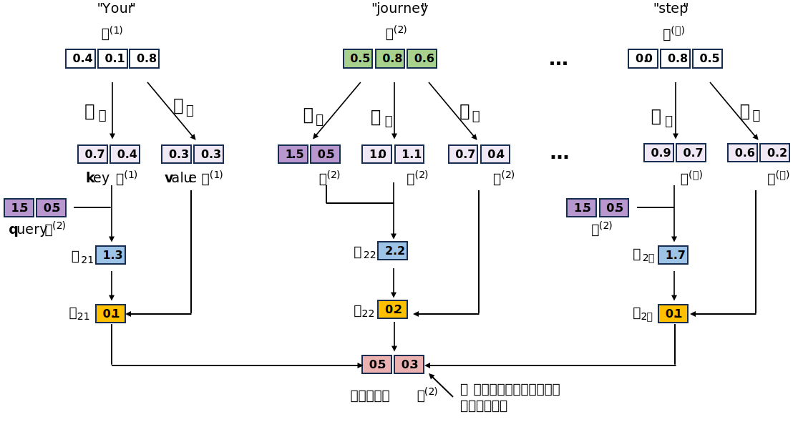

```python
import mindspore
# mindspore.set_context(device_target='CPU')
# mindspore.set_context(device_target='GPU')
mindspore.set_context(device_target="Ascend")
mindspore.set_context(device_id=0)
mindspore.run_check()
```

    MindSpore version:  2.1.0
    The result of multiplication calculation is correct, MindSpore has been installed on platform [Ascend] successfully!


# 3 注意力机制

在这一章，我们将深入研究大语言模型(LLM)架构中最核心的组成部分之一 —— 注意力机制(Attention Mechanism)。注意力机制是现代LLM能够理解长文本、捕捉上下文关系并生成连贯输出的关键所在。


如上图所示，注意力机制允许模型在处理序列数据时，动态地关注输入序列中的不同部分，从而有效地捕捉长距离依赖关系。我们将实现四种不同的注意力机制变体，循序渐进地理解注意力机制的工作原理及其在LLM中的应用。
 


## 3.1 长序列建模

在深入注意力机制之前，让我们先理解为什么在处理自然语言时需要有效地建模长序列数据。

- 假设我们想要开发一种语言翻译模型：将文本从一种语言翻译成另一种语言。如图所示，由于源语言和目标语言的语法结构差异，我们不能简单地逐字翻译文本。比如在英语到德语的翻译中，动词的位置往往会发生变化，这要求模型能够理解整个句子的结构而不仅仅是局部单词。


- 为了解决这个问题，通常需要引入编码器-解码器架构(Encoder-Decoder Architecture)。编码器负责读取并处理输入文本，将其转换为内部表示（通常是一个向量或向量序列），然后解码器利用这个内部表示来生成翻译后的文本。这种架构允许模型在生成输出时考虑输入序列的整体信息。


- 在 Transformer 模型出现之前，循环神经网络(RNN)是构建编码器-解码器架构的主流选择。编码器将源语言中的一系列词元作为输入，并通过其隐藏状态逐步构建对整个输入序列的压缩表示。然后，解码器利用这个隐藏状态逐步生成目标语言的句子。

- 然而，编码器-解码器 RNN 架构存在一个潜在的局限性：在解码阶段，主要依赖于编码器最后传递过来的隐藏状态作为初始状态进行后续的解码操作，无法直接访问编码器在每个时间步产生的隐藏状态。对于依赖关系跨越长距离的复杂句子，这可能导致上下文信息丢失，影响翻译质量。

- 为了解决这些问题，研究人员提出了多种改进方法，其中最成功的是引入注意力机制(Attention Mechanism)，它允许解码器在生成每个目标词元时，动态地关注源序列中的不同部分。这种方法大大提高了模型处理长序列数据的能力，并成为后来Transformer等架构的基础。

## 3.2 利用注意力机制捕捉数据依赖关系

注意力机制的核心思想是允许模型在处理序列数据时，有选择地关注输入序列的不同部分，从而更有效地捕捉数据之间的依赖关系。

在编码器-解码器架构中，注意力机制允许解码器选择性地访问输入序列的不同部分，而不仅仅依赖于编码器的最终隐藏状态。这种选择的重要性或程度由注意力权重（也称为对齐权重或注意力得分）来决定，它表示当前解码步骤与输入序列中各个位置的相关性大小。


在RNN架构之后，研究人员发现了其对于构建用于自然语言处理的深度神经网络存在一些固有的局限性，比如难以并行计算、难以捕捉长距离依赖等。为了克服这些限制，研究人员提出了Transformer架构作为替代方案，其核心在于引入了自注意力机制(Self-Attention Mechanism)。

自注意力机制是注意力机制的一种特殊形式，它允许模型在处理输入序列时，能够考虑同一序列中所有位置之间的依赖关系。与传统的注意力机制不同，自注意力不要求有明确的编码器-解码器架构，而是可以在单一序列上操作，使每个位置都能关注到序列中的所有其他位置。这种机制极大地增强了模型捕捉长距离依赖的能力，并成为现代LLM(如GPT系列、BERT等)的核心组件。


## 3.3 利用自注意力机制关注输入的不同部分

### 3.3.1 简单自注意力机制


现在，让我们从最基础的自注意力变体开始，逐步构建对这一机制的理解。为了简化，我们先实现一个不包含任何可训练权重的简单自注意力机制。

给定一个输入序列 $x$，由 $T$ 个元素组成，表示为$x^{(1)}$到 $x^{(T)}$，每个元素可以是一个词元的嵌入向量。


我们的目标是为输入序列中的每个元素 $x^{(i)}$计算一个上下文向量$z^{(i)}$，这个上下文向量包含了与该元素相关的上下文信息：

- 上下文向量$z^{(i)}$是输入序列中所有元素 $x^{(1)},\cdots,x^{(T)}$ 的加权和
 
- 例如，计算第二个元素 $x^{(2)}$的上下文向量$z^{(2)}$时
    
    - $z^{(2)}$ 是$x^{(1)},\cdots,x^{(T)}$的加权和，其中权重由各个输入元素与$x^{(2)}$的相关性决定

    - 这种相关性越高，对应元素在计算上下文向量时的权重就越大


以计算第二个元素 $x^{(2)}$的上下文向量$z^{(2)}$为例。

**step 1** 计算未规范化的注意力分数$\omega$。

自注意力机制首先计算序列中每个元素与其他元素之间的相关性得分。假设我们以第二个输入元素作为查询(query)，即$q^{(2)} = x^{(2)}$，通过计算它与所有输入元素(包括自身)的点积，得到未归一化的注意力得分：

- $\omega_{21} = x^{(1)} q^{(2)\top}$ (第一个元素与查询的相关性)
- $\omega_{22} = x^{(2)} q^{(2)\top}$ (第二个元素与查询的相关性)
- $\omega_{23} = x^{(3)} q^{(2)\top}$ (第三个元素与查询的相关性)
- $\cdots$
- $\omega_{2T} = x^{(T)} q^{(2)\top}$ (第T个元素与查询的相关性)

这里，注意力得分$\omega_{21}$的下标"21"表示第2个位置作为查询，与第1个位置元素计算的相关性得分。

为了具体演示这个过程，我们以输入文本\"Your journey starts with one step.\"为例，使用三维嵌入向量表示每个词元：


```python
from mindspore import Tensor

inputs = Tensor(
  [[0.43, 0.15, 0.89], # Your     (x^1)
   [0.55, 0.87, 0.66], # journey  (x^2)
   [0.57, 0.85, 0.64], # starts   (x^3)
   [0.22, 0.58, 0.33], # with     (x^4)
   [0.77, 0.25, 0.10], # one      (x^5)
   [0.05, 0.80, 0.55]] # step     (x^6)
)
```

实现自注意力机制的第一步是计算注意力分数，即计算第二个词元\"journey\"(即$x^{(2)}$)与所有词元（包括自身）的相关性得分。如下图所示，这是通过计算点积来实现的。


通过计算$x^{(2)}$与其他输入词元的嵌入向量的点积，我们可以得到表示它们之间相关性的未归一化注意力分数：


```python
import mindspore.numpy as np
```


```python
query = inputs[1] 
attn_scores_2 = np.empty(inputs.shape[0]) 
for i, x_i in enumerate(inputs): 
    attn_scores_2[i] = np.dot(x_i, query) 
print(attn_scores_2)
```

    [0.95440006 1.4950001  1.4754001  0.8434     0.707      1.0865    ]


**step 2** 将注意力分数归一化为权重，使得所有位置的权重之和为1。

获得未归一化的注意力分数后，需要将它们转换为概率分布形式的注意力权重，确保所有权重之和为1。这样，上下文向量就是输入向量的加权平均，而不是简单的加权和。


```python
attn_weights_2_tmp = attn_scores_2 / attn_scores_2.sum() 
print("Attention weights:", attn_weights_2_tmp) 
print("Sum:", attn_weights_2_tmp.sum())
```

    Attention weights: [0.14545013 0.22783732 0.22485028 0.12853377 0.10774647 0.1655821 ]
    Sum: 1.0


使用softmax函数进行归一化是注意力机制中的标准做法。Softmax函数不仅能够将原始的注意力分数转换为和为1的概率分布，而且它还具有处理极值的能力，并在训练过程中提供稳定的梯度。

从直观上理解，softmax函数会增强较大分数的影响，同时减弱较小分数的影响，使得注意力更加集中在相关性较高的位置。以下是用于归一化注意力分数的softmax函数的实现：


```python
def softmax_naive(x):
    return np.exp(x) / np.sum(np.exp(x), axis=0)

attn_weights_2_naive = softmax_naive(attn_scores_2)

print("Attention weights:", attn_weights_2_naive)
print("Sum:", attn_weights_2_naive.sum())
```

    Attention weights: [0.13854758 0.23789132 0.23327403 0.1239916  0.10818187 0.1581136 ]
    Sum: 1.0


这种简单的 softmax 实现（softmax_naive）在处理非常大或非常小的输入值时，可能会遇到数值不稳定问题，例如指数运算可能导致溢出(overflow)或下溢(underflow)。

为了解决这些问题，实际应用中通常会使用经过数值优化的softmax实现，比如先减去最大值再进行指数计算，或者使用深度学习框架提供的优化版本：


```python
from mindspore import nn
```


```python
softmax = nn.Softmax(axis=0)
attn_weights_2 = softmax(attn_scores_2)

print("Attention weights:", attn_weights_2)
print("Sum:", attn_weights_2.sum())
```

    Attention weights: [0.13854758 0.2378913  0.23327403 0.1239916  0.10818186 0.15811361]
    Sum: 1.0


**step 3** 将输入的嵌入向量$x^{(i)}$与相应的注意力权重相乘，然后求和，计算出上下文向量。

一旦我们有了归一化的注意力权重，就可以计算上下文向量$z^{(2)}$，它是输入向量的加权和，权重由注意力机制确定。这个上下文向量融合了与当前位置相关的整个序列的信息。


```python
query = inputs[1] # 2nd input token is the query

context_vec_2 = np.zeros(query.shape)
for i,x_i in enumerate(inputs):
    context_vec_2 += attn_weights_2[i]*x_i

print(context_vec_2)
```

    [0.44186574 0.651482   0.56830883]


### 3.3.2 计算所有输入的注意力权重

到目前为止，我们只计算了针对第二个输入词元的注意力权重和上下文向量。在实际应用中，我们需要为序列中的每个位置计算上下文向量，如下图所示。这样，每个位置都能获得融合了整个序列信息的表示。


计算所有位置的上下文向量的过程是相似的：首先为每个位置计算注意力分数，然后对这些分数进行归一化得到注意力权重，最后利用这些权重对输入进行加权求和得出每个位置的上下文向量。


我们可以通过循环来计算所有位置的注意力分数，即每个输入与其他所有输入的点积：


```python
attn_scores = np.empty((6, 6))

for i, x_i in enumerate(inputs):
    for j, x_j in enumerate(inputs):
        attn_scores[i, j] = np.dot(x_i, x_j)

print(attn_scores)
```

    [[0.9994999  0.95440006 0.9422     0.4753     0.4576     0.63100004]
     [0.95440006 1.4950001  1.4754001  0.8434     0.707      1.0865    ]
     [0.9422     1.4754001  1.457      0.8296     0.7154     1.0605    ]
     [0.4753     0.8434     0.8296     0.49369997 0.34739998 0.6565    ]
     [0.4576     0.707      0.7154     0.34739998 0.66539997 0.2935    ]
     [0.63100004 1.0865     1.0605     0.6565     0.2935     0.94500005]]


虽然上述循环方法直观易懂，但在实际应用中，我们可以利用矩阵乘法更高效地计算注意力分数。如果将输入序列表示为矩阵$X$，其中每行是一个词元的嵌入向量，则$X$乘以$X$的转置即可得到所有点积：


```python
attn_scores = inputs @ inputs.T 
print(attn_scores)
```

    [[0.9994999  0.95440006 0.9422     0.4753     0.4576     0.63100004]
     [0.95440006 1.4950001  1.4754001  0.8434     0.707      1.0865    ]
     [0.9422     1.4754001  1.457      0.8296     0.7154     1.0605    ]
     [0.4753     0.8434     0.8296     0.49369997 0.34739998 0.6565    ]
     [0.4576     0.707      0.7154     0.34739998 0.66539997 0.2935    ]
     [0.63100004 1.0865     1.0605     0.6565     0.2935     0.94500005]]


步骤 2：对每一行的注意力分数进行归一化，使得每行的值总和为 1，形成注意力权重矩阵


```python
softmax = nn.Softmax(axis=-1)
attn_weights = softmax(attn_scores) 
print(attn_weights)
```

    [[0.20983472 0.20058143 0.1981492  0.12422821 0.12204872 0.14515765]
     [0.13854758 0.2378913  0.23327403 0.1239916  0.10818186 0.15811361]
     [0.1390076  0.23692146 0.23260196 0.1242044  0.11080021 0.15646443]
     [0.1435269  0.20739442 0.20455202 0.14619222 0.12629524 0.1720392 ]
     [0.15261085 0.19583867 0.19749065 0.13668668 0.18785892 0.12951429]
     [0.13847117 0.21836372 0.21275942 0.14204757 0.09880637 0.18955176]]


```python
row_2_sum = sum([0.1385, 0.2379, 0.2333, 0.1240, 0.1082, 0.1581]) 
print("Row 2 sum:", row_2_sum) 
print("All row sums:", attn_weights.sum(axis=-1))
```

    Row 2 sum: 1.0
    All row sums: [0.99999994 1.         1.         1.         1.         1.        ]


步骤 3：使用注意力权重矩阵对输入进行加权求和，计算所有输入词元的上下文向量


```python
all_context_vecs = attn_weights @ inputs
print(all_context_vecs)
```

    [[0.44205937 0.5930985  0.578989  ]
     [0.44186574 0.651482   0.56830883]
     [0.44312754 0.6495946  0.5670731 ]
     [0.43038973 0.6298281  0.55102706]
     [0.46710178 0.5909928  0.5265966 ]
     [0.41772446 0.6503232  0.56453526]]


最后，我们可以验证这种矩阵方法计算的第二行上下文向量与我们之前单独计算的结果是一致的：


```python
print("Previous 2nd context vector:", context_vec_2)
```

    Previous 2nd context vector: [0.44186574 0.651482   0.56830883]


## 3.4 利用可训练权重实现自注意力机制

到目前为止，我们实现的简单自注意力机制没有任何可训练的参数，仅仅是根据输入向量的直接相似度计算注意力权重。接下来，我们将实现原始Transformer架构、GPT模型和大多数现代LLM中使用的更复杂的自注意力机制，它包含可训练的权重矩阵，能够更灵活地适应不同的任务需求。


这种高级自注意力机制引入了三个可训练的权重矩阵，用于将输入转换为查询(Query)、键(Key)和值(Value)向量。这种设计使模型能够学习如何最有效地关注输入的不同部分，从而生成更具表现力的上下文表示。


### 3.4.1 计算注意力权重

在这种增强版的自注意力机制中，我们引入三个可训练的权重矩阵$W_q$、$W_k$和$W_v$，它们分别用于生成查询、键和值向量：

- 查询向量(Query)：$q^{(i)} = W_q x^{(i)}$ - 用于与键向量计算相关性

- 键向量(Key)：$k^{(i)} = W_k x^{(i)}$ - 用于被查询向量「查询」

- 值向量(Value)：$v^{(i)} = W_v x^{(i)}$ - 用于根据注意力权重生成上下文向量

这些可学习的投影矩阵允许模型分别优化用于计算相关性和整合信息的特征表示，大大增强了注意力机制的表达能力。


为了更清晰地理解这个过程，我们将使用不同的输入(`d_in=3`)和输出(`d_out=2`)维度:


```python
x_2 = inputs[1] # second input element
d_in = inputs.shape[1] # the input embedding size, d=3
d_out = 2 # the output embedding size, d=2
```

首先，我们需要初始化三个权重矩阵$W_q$、$W_k$和$W_v$，它们用于将输入嵌入转换为查询、键和值向量：


```python
import mindspore
import mindspore.ops as ops
from mindspore import Parameter
```


```python
mindspore.set_seed(123)

W_query = Parameter(ops.rand(d_in, d_out), requires_grad=False)
W_key   = Parameter(ops.rand(d_in, d_out), requires_grad=False)
W_value = Parameter(ops.rand(d_in, d_out), requires_grad=False)
```

在实际的模型训练中，这些权重矩阵需要设置 `require_grad=True`，使它们可以通过反向传播更新。接下来，我们使用这些权重矩阵计算第二个词元的查询、键和值向量：


```python
query_2 = x_2 @ W_query # _2 because it's with respect to the 2nd input element
key_2 = x_2 @ W_key 
value_2 = x_2 @ W_value

print(query_2)
```

    [0.7817213 1.2208791]


同样，我们可以通过矩阵乘法一次性计算所有词元的键向量和值向量：


```python
keys = inputs @ W_key 
values = inputs @ W_value

print("keys.shape:", keys.shape)
print("values.shape:", values.shape)
```

    keys.shape: (6, 2)
    values.shape: (6, 2)


有了查询向量和键向量后，我们可以计算注意力分数。与简单自注意力不同，这里的注意力分数是通过查询向量与键向量的点积计算的，而不是直接使用输入嵌入：


```python
keys_2 = keys[1] # Python starts index at 0
attn_score_22 = np.dot(query_2, keys_2)
print(attn_score_22)
```

    2.002905


接下来，我们可以将这种计算扩展到所有的查询-键对，得到完整的注意力分数矩阵：


```python
attn_scores_2 = query_2 @ keys.T # All attention scores for given query
print(attn_scores_2)
```

    [1.1375254 2.002905  1.9859064 1.1259952 1.1205468 1.3618919]


在Transformer架构中，存在一个重要的缩放因子，它是键向量维度的平方根。这个缩放因子有助于稳定梯度，防止softmax函数进入饱和区域。应用缩放因子和softmax函数后，我们得到最终的注意力权重：


```python
softmax = nn.Softmax(axis=-1)
d_k = keys.shape[1]
attn_weights_2 = softmax(attn_scores_2 / d_k**0.5)
print(attn_weights_2)
```

    [0.1279138  0.23586798 0.23304987 0.12687513 0.12638728 0.14990588]


最后，我们将注意力权重应用于值向量，得到上下文向量。这个上下文向量包含了由注意力机制选择性关注后的信息，可以用于后续的处理或预测：




```python
context_vec_2 = attn_weights_2 @ values
print(context_vec_2)
```

    [0.8062484  0.93906933]


### 3.4.2 实现注意力机制的 Python 类


为了使代码更加模块化和易于使用，我们可以将上述步骤封装成一个Python类。这种封装不仅提高了代码的可读性和可维护性，也使得自注意力机制可以方便地集成到更大的模型架构中。


```python
import mindspore.nn as nn

class SelfAttention_v1(nn.Cell):

    def __init__(self, d_in, d_out):
        super(SelfAttention_v1, self).__init__()
        self.W_query = Parameter(ops.rand(d_in, d_out))
        self.W_key   = Parameter(ops.rand(d_in, d_out))
        self.W_value = Parameter(ops.rand(d_in, d_out))
        self.softmax = nn.Softmax(axis=-1)

    def construct(self, x):
        keys = x @ self.W_key
        queries = x @ self.W_query
        values = x @ self.W_value
        
        attn_scores = queries @ keys.T # omega
        attn_weights = self.softmax(
            attn_scores / keys.shape[-1]**0.5
        )

        context_vec = attn_weights @ values
        return context_vec

mindspore.set_seed(123)
sa_v1 = SelfAttention_v1(d_in, d_out)
print(sa_v1(inputs))
```

    [[0.79736733 0.92352426]
     [0.8062485  0.93906945]
     [0.8061194  0.93896097]
     [0.7872808  0.9079325 ]
     [0.7926477  0.91897345]
     [0.7900415  0.9113404 ]]


接下来，我们可以进一步优化这个实现，利用MindSpore提供的`nn.Dense`层替代手动定义的可训练权重矩阵，使代码更符合框架风格：


```python
class SelfAttention_v2(nn.Cell):
    def __init__(self, d_in, d_out, qkv_bias=False):
        super(SelfAttention_v2, self).__init__()
        # 使用 nn.Dense 定义线性层
        self.W_query = nn.Dense(d_in, d_out, has_bias=qkv_bias)
        self.W_key = nn.Dense(d_in, d_out, has_bias=qkv_bias)
        self.W_value = nn.Dense(d_in, d_out, has_bias=qkv_bias)
        self.softmax = nn.Softmax(axis=-1)

    def construct(self, x):
        # 计算 keys, queries, values
        keys = self.W_key(x)
        queries = self.W_query(x)
        values = self.W_value(x)

        # 计算注意力分数
        attn_scores = ops.matmul(queries, keys.T)
        # 缩放注意力分数
        scale_factor = keys.shape[-1] ** 0.5
        scaled_attn_scores = attn_scores / scale_factor

        # 计算注意力权重
        attn_weights = self.softmax(scaled_attn_scores)

        # 计算上下文向量
        context_vec = ops.matmul(attn_weights, values)
        return context_vec

mindspore.set_seed(789)
sa_v2 = SelfAttention_v2(d_in, d_out)
print(sa_v2(inputs))
```

    [[-0.15587379 -0.36927402]
     [-0.14788963 -0.37355042]
     [-0.1478706  -0.37344784]
     [-0.14899006 -0.3725437 ]
     [-0.14874612 -0.37055266]
     [-0.14906609 -0.37363836]]


## 3.5 利用因果注意力隐藏未来的单词


在语言生成任务中，我们通常需要确保模型在预测下一个词时只能看到之前的词，而不能看到未来的词。这种约束是很自然的，因为在生成文本时，我们是从左到右逐个生成词的，未来的词尚未存在。


因果注意力机制（Causal Attention）通过掩码操作实现了这一约束，确保每个位置只能关注自身及其之前的位置。在因果注意力中，需要屏蔽（掩码）对角线上方的注意力权重，也就是那些对应于"未来"位置的权重，防止信息从未来位置泄露到当前位置。
    


### 3.5.1 应用因果注意掩码

下面我们将实现因果注意力，其核心是创建和应用一个下三角掩码，确保每个位置只能看到自身及其之前的位置。


第一步，我们使用上一节的方法计算注意力权重。这里我们先得到普通的注意力权重矩阵，然后再应用掩码：


```python
# Reuse the query and key weight matrices of the
# SelfAttention_v2 object from the previous section for convenience
queries = sa_v2.W_query(inputs)
keys = sa_v2.W_key(inputs) 
attn_scores = queries @ keys.T
softmax = nn.Softmax(axis=-1)

attn_weights = softmax(attn_scores / keys.shape[-1]**0.5)
print(attn_weights)
```

    [[0.17708538 0.16682708 0.16690864 0.16154803 0.16648889 0.16114198]
     [0.15290368 0.16976361 0.1694357  0.17110434 0.16246879 0.17432387]
     [0.15289992 0.16963565 0.16931547 0.17120253 0.16261601 0.17433047]
     [0.1563714  0.16894543 0.16870582 0.17000996 0.16362132 0.17234604]
     [0.15662041 0.16653182 0.16643864 0.17168735 0.1664594  0.17226237]
     [0.15606658 0.17026657 0.16994365 0.16917174 0.1620771  0.17247434]]


第二步，创建掩码矩阵：将注意力权重矩阵对角线上方的值用0掩码。这个掩码是一个下三角矩阵，其中对角线及以下的元素为1，对角线以上的元素为0：


```python
context_length = attn_scores.shape[0]
mask_simple = ops.tril(ops.ones((context_length, context_length), mindspore.float32))
print(mask_simple)
```

    [[1. 0. 0. 0. 0. 0.]
     [1. 1. 0. 0. 0. 0.]
     [1. 1. 1. 0. 0. 0.]
     [1. 1. 1. 1. 0. 0.]
     [1. 1. 1. 1. 1. 0.]
     [1. 1. 1. 1. 1. 1.]]


将注意力权重矩阵对角线上方的值归零


```python
masked_simple = attn_weights*mask_simple
print(masked_simple)
```

    [[0.17708538 0.         0.         0.         0.         0.        ]
     [0.15290368 0.16976361 0.         0.         0.         0.        ]
     [0.15289992 0.16963565 0.16931547 0.         0.         0.        ]
     [0.1563714  0.16894543 0.16870582 0.17000996 0.         0.        ]
     [0.15662041 0.16653182 0.16643864 0.17168735 0.1664594  0.        ]
     [0.15606658 0.17026657 0.16994365 0.16917174 0.1620771  0.17247434]]


第三步：对掩码矩阵进行归一化操作，使得每行的和值等于1。由于我们已经屏蔽了一些位置，我们需要重新归一化剩余的权重，确保它们仍然构成一个有效的概率分布：


```python
# 创建 ReduceSum 操作符实例，指定保持维度
reduce_sum = ops.ReduceSum(keep_dims=True)
# 沿着最后一个维度求和
row_sums = reduce_sum(masked_simple, -1)
masked_simple_norm = masked_simple / row_sums
print(masked_simple_norm)
```

    [[1.         0.         0.         0.         0.         0.        ]
     [0.4738741  0.52612585 0.         0.         0.         0.        ]
     [0.31086633 0.34489235 0.34424138 0.         0.         0.        ]
     [0.23548752 0.25442338 0.25406253 0.2560265  0.         0.        ]
     [0.18921505 0.20118913 0.20107657 0.20741759 0.20110165 0.        ]
     [0.15606658 0.17026657 0.16994365 0.16917174 0.1620771  0.17247434]]


我们还可以对这段代码进行改进，以更少的步骤更有效地实现掩蔽注意权重的计算。一种常用的方法是在应用softmax函数之前，将需要掩蔽的位置设置为负无穷大（-∞）。这样，这些位置在通过softmax函数后会变为接近零的值，有效地实现了掩蔽操作。


softmax 函数可以将输入向量转换为概率分布。在softmax函数的作用下，负无穷大的值会趋近于0，在最终的注意力权重矩阵中，被掩蔽的部分将被置为0。这种方法更高效，因为它避免了显式的归一化步骤：


```python

mask = ops.triu(ops.ones((context_length, context_length), mindspore.float32), diagonal=1)
# 获取负无穷常量
neg_inf = mindspore.Tensor(-float('inf'), dtype=mindspore.float32)
masked = ops.masked_fill(attn_scores, mask.bool(), neg_inf)
print(masked)
```

    [[ 0.14097424        -inf        -inf        -inf        -inf        -inf]
     [-0.10974284  0.03818224        -inf        -inf        -inf        -inf]
     [-0.11289321  0.03400017  0.03132835        -inf        -inf        -inf]
     [-0.0824612   0.02691678  0.02490959  0.03579977        -inf        -inf]
     [-0.13766424 -0.05088637 -0.05167788 -0.00776885 -0.05150147        -inf]
     [-0.05454344  0.06860979  0.06592514  0.05948692 -0.00110114  0.08682943]]


将 softmax 函数应用于掩码矩阵，生成符合因果约束的注意力权重：


```python
softmax = nn.Softmax(axis=-1)
attn_weights = softmax(masked / keys.shape[-1]**0.5) 
print(attn_weights)
```

    [[1.         0.         0.         0.         0.         0.        ]
     [0.47387412 0.5261259  0.         0.         0.         0.        ]
     [0.31086633 0.34489232 0.34424138 0.         0.         0.        ]
     [0.2354875  0.2544234  0.25406256 0.2560265  0.         0.        ]
     [0.18921505 0.20118913 0.20107657 0.20741759 0.20110166 0.        ]
     [0.15606658 0.17026657 0.16994365 0.16917174 0.1620771  0.17247434]]


### 3.5.2 引入 dropout


深度学习中的 Dropout 是一种在训练过程中随机丢弃一部分神经元来防止模型过拟合的正则化技术。通过随机丢弃神经元，模型不会过度依赖于特定的神经元或特征，从而提高了模型的泛化能力。Dropout强制模型学习更鲁棒的特征表示，因为它必须能够在某些信息缺失的情况下仍然正常工作。

在 Transformer 架构中，包括 GPT 等模型，注意力机制中的 Dropout 通常在两个特定位置应用：
1. 计算注意力权重后
2. 在将注意力权重作用于值向量后

这里，我们将在计算注意力权重后应用 Dropout，通过随机置零一部分注意力权重，强制模型不要过度依赖于特定的注意力连接，如图所示。


在下面的代码示例中，我们使用50%的丢弃率(dropout rate)，这意味着大约一半的注意力连接会被随机丢弃。在实际的LLM训练中，通常会使用较小的丢弃率(如0.1或0.2)，以在正则化效果和模型表达能力之间取得平衡。

为了直观理解Dropout的效果，我们先将其应用于一个简单的全1矩阵：


```python
mindspore.set_seed(123)
dropout = nn.Dropout(p=0.5) # dropout rate of 50%
example = ops.ones((6, 6)) # create a matrix of ones
# 开启训练模式
dropout.set_train(True)
print(dropout(example))
```

    [[2. 2. 2. 2. 0. 0.]
     [2. 2. 0. 0. 0. 0.]
     [2. 0. 0. 2. 2. 2.]
     [2. 0. 2. 2. 0. 0.]
     [2. 0. 0. 0. 2. 2.]
     [2. 2. 2. 0. 2. 2.]]


```python
mindspore.set_seed(123) 
print(dropout(attn_weights))
```

    [[0.         0.         0.         0.         0.         0.        ]
     [0.94774824 1.0522518  0.         0.         0.         0.        ]
     [0.         0.         0.         0.         0.         0.        ]
     [0.470975   0.         0.         0.         0.         0.        ]
     [0.         0.40237826 0.40215313 0.41483518 0.         0.        ]
     [0.         0.         0.         0.         0.         0.        ]]


### 3.5.3 实现因果注意力机制类


现在我们将因果掩码和 dropout 机制整合到一个完整的Python类中，实现完整的因果自注意力机制。这种注意力机制将成为我们后续实现GPT模型的核心组件之一。

首先，我们要确保代码可以处理由多个输入组成的批次（batch）。在实际应用中，模型通常会同时处理多个序列以提高计算效率。为了简化测试，我们通过复制先前的输入来模拟批处理情况：


```python
batch = ops.stack((inputs, inputs), axis=0) 
print(batch.shape) 
```

    (2, 6, 3)


```python
class CausalAttention(nn.Cell):

    def __init__(self, d_in, d_out, context_length,
                 dropout, qkv_bias=False):
        super().__init__()
        self.d_out = d_out
        self.W_query = nn.Dense(d_in, d_out, has_bias=qkv_bias)
        self.W_key   = nn.Dense(d_in, d_out, has_bias=qkv_bias)
        self.W_value = nn.Dense(d_in, d_out, has_bias=qkv_bias)
        self.dropout = nn.Dropout(p=dropout) # New
        # self.register_buffer(
            # 'mask', 
            # ops.triu(ops.ones((context_length, context_length), dtype=mindspore.float32), diagonal=1)) # New

        # 创建掩码矩阵
        ones_matrix = ops.ones((context_length, context_length), mindspore.float32)
        mask = ops.triu(ones_matrix, diagonal=1)
        self.mask = mindspore.Parameter(mask, requires_grad=False)


    def construct(self, x):
        b, num_tokens, d_in = x.shape # New batch dimension b
        keys = self.W_key(x)
        queries = self.W_query(x)
        values = self.W_value(x)
         # 计算注意力分数
        keys_transposed = ops.transpose(keys, (0, 2, 1))
        attn_scores = queries @ keys_transposed
        # 应用掩码
        neg_inf = mindspore.Tensor(-float('inf'), dtype=mindspore.float32)
        mask_bool = self.mask[:num_tokens, :num_tokens].astype(mindspore.bool_)
        attn_scores = ops.masked_fill(  # New, _ ops are in-place
            attn_scores, mask_bool, neg_inf)  # `:num_tokens` to account for cases where the number of tokens in the batch is smaller than the supported context_size
        softmax = nn.Softmax(axis=-1)
        attn_weights = softmax(attn_scores / keys.shape[-1]**0.5)
        attn_weights = self.dropout(attn_weights) # New

        context_vec = attn_weights @ values
        return context_vec

mindspore.set_seed(123)

context_length = batch.shape[1]
ca = CausalAttention(d_in, d_out, context_length, 0.0)

context_vecs = ca(batch)

print(context_vecs)
print("context_vecs.shape:", context_vecs.shape)
```

    [[[ 0.6989094  -0.01063734]
      [ 0.8213648  -0.19209932]
      [ 0.8643445  -0.25795853]
      [ 0.7828231  -0.2632103 ]
      [ 0.7394768  -0.25754046]
      [ 0.71951777 -0.26029873]]
    
     [[ 0.6989094  -0.01063734]
      [ 0.8213648  -0.19209932]
      [ 0.8643445  -0.25795853]
      [ 0.7828231  -0.2632103 ]
      [ 0.7394768  -0.25754046]
      [ 0.71951777 -0.26029873]]]
    context_vecs.shape: (2, 6, 2)


迄今为止，我们已经实现了因果注意力机制，它确保了信息只能从过去流向未来，这对于自回归生成任务是必要的。接下来，我们将扩展这一概念，并实现多头注意力机制，以进一步提升模型的表达能力。


## 3.6 将单头注意力扩展到多头注意力

单头注意力机制已经很强大，但它可能无法同时捕捉序列中不同类型的关系模式。例如，在处理自然语言时，我们可能希望同时关注语法关系、语义相似性、主题一致性等多种关系。

多头注意力机制（Multi-Head Attention）通过并行运行多个注意力"头"来解决这个问题，每个头可以专注于捕捉不同类型的关系。这就像是让多个专家从不同角度分析同一个问题，然后综合他们的见解。
    

### 3.6.1 堆叠多个单头注意力层

实现多头注意力机制的过程包括创建多个自注意力机制的实例（如图3.18所示），每个实例具有独立的权重，并随后将这些实例的输出进行拼接。


多头注意力机制的核心思想在于，通过并行地应用多个不同的、可学习的线性投影来运行注意力机制。具体来说，输入数据（如查询、键和值向量）会分别乘以相应的权重矩阵，从而得到多个投影后的表示。每个"头"使用不同的投影，因此可以关注输入的不同方面或特征。
    


```python
class MultiHeadAttentionWrapper(nn.Cell):

    def __init__(self, d_in, d_out, context_length, dropout, num_heads, qkv_bias=False):
        super(MultiHeadAttentionWrapper, self).__init__()
        self.heads = nn.CellList(
            [CausalAttention(d_in, d_out, context_length, dropout, qkv_bias) 
             for _ in range(num_heads)]
        )

    def construct(self, x):
        return ops.cat([head(x) for head in self.heads], axis=-1)


mindspore.set_seed(123)

context_length = batch.shape[1] # This is the number of tokens
d_in, d_out = 3, 2
mha = MultiHeadAttentionWrapper(
    d_in, d_out, context_length, 0.0, num_heads=2
)

context_vecs = mha(batch)

print(context_vecs)
print("context_vecs.shape:", context_vecs.shape)
```

    [[[ 0.6989094  -0.01063734 -0.17242233 -0.48101062]
      [ 0.8213648  -0.19209932 -0.04481881 -0.56809145]
      [ 0.8643445  -0.25795853 -0.00637956 -0.5930796 ]
      [ 0.7828231  -0.2632103   0.0329925  -0.5441511 ]
      [ 0.7394768  -0.25754046 -0.037752   -0.46404293]
      [ 0.71951777 -0.26029873  0.02741851 -0.4850085 ]]
    
     [[ 0.6989094  -0.01063734 -0.17242233 -0.48101062]
      [ 0.8213648  -0.19209932 -0.04481881 -0.56809145]
      [ 0.8643445  -0.25795853 -0.00637956 -0.5930796 ]
      [ 0.7828231  -0.2632103   0.0329925  -0.5441511 ]
      [ 0.7394768  -0.25754046 -0.037752   -0.46404293]
      [ 0.71951777 -0.26029873  0.02741851 -0.4850085 ]]]
    context_vecs.shape: (2, 6, 4)


由于有两个输入文本，因此得到的 context_vecs 张量的第一个维度是 2；第二个维度指的是每个输入中的 6 个词元；第三个维度指的是每个词元的4维嵌入（由两个2维的头拼接而成）。多头注意力机制通过并行处理，丰富了每个位置的表示，使模型能够同时关注不同类型的信息。

### 3.6.2 通过权重分割实现多头注意力

虽然上面的 `MultiHeadAttentionWrapper` 类实现了多头注意力的功能，但它通过实例化多个完整的注意力头，这在计算上可能不是最高效的。另一种实现方式是通过权重矩阵分割，使用单个更大的权重矩阵，然后在计算过程中将其分割成多个头。

让我们比较这两种方法：

- 在 `MultiHeadAttentionWrapper` 类中，我们为每个头初始化独立的权重矩阵（例如$W_{q1}$和$W_{q2}$），并单独计算每个头的查询矩阵$Q_{1}$和$Q_{2}$（上图）。
- 在更高效的 `MultiheadAttention` 类中，我们初始化一个较大的权重矩阵$W$，执行一次矩阵乘法得到查询矩阵$Q$，然后将其拆分为$Q_{1}$和$Q_{2}$（下图）。

这种优化减少了矩阵乘法的次数，并且在GPU等并行计算硬件上更高效。


```python
class MultiHeadAttention(nn.Cell):
    def __init__(self, d_in, d_out, context_length, dropout, num_heads, qkv_bias=False):
        super(MultiHeadAttention, self).__init__()
        assert (d_out % num_heads == 0), \
            "d_out must be divisible by num_heads"

        self.d_out = d_out
        self.num_heads = num_heads
        self.head_dim = d_out // num_heads # Reduce the projection dim to match desired output dim

        self.W_query = nn.Dense(d_in, d_out, has_bias=qkv_bias)
        self.W_key = nn.Dense(d_in, d_out, has_bias=qkv_bias)
        self.W_value = nn.Dense(d_in, d_out, has_bias=qkv_bias)
        self.out_proj = nn.Dense(d_out, d_out)  # Linear layer to combine head outputs
        self.dropout = nn.Dropout(p=dropout)
        # 创建掩码矩阵
        ones_matrix = ops.ones((context_length, context_length), mindspore.float32)
        mask = ops.triu(ones_matrix, diagonal=1)
        self.mask = mindspore.Parameter(mask, requires_grad=False)

    def construct(self, x):
        b, num_tokens, d_in = x.shape

        keys = self.W_key(x) # Shape: (b, num_tokens, d_out)
        queries = self.W_query(x)
        values = self.W_value(x)

        # 重塑张量以分离头
        keys = ops.reshape(keys, (b, num_tokens, self.num_heads, self.head_dim))
        values = ops.reshape(values, (b, num_tokens, self.num_heads, self.head_dim))
        queries = ops.reshape(queries, (b, num_tokens, self.num_heads, self.head_dim))

        # 交换维度
        keys = ops.transpose(keys, (0, 2, 1, 3))
        queries = ops.transpose(queries, (0, 2, 1, 3))
        values = ops.transpose(values, (0, 2, 1, 3))

        # 计算注意力分数
        keys_transposed = ops.transpose(keys, (0, 1, 3, 2))
        attn_scores = ops.matmul(queries, keys_transposed)

        # 准备掩码
        mask_bool = self.mask[:num_tokens, :num_tokens].astype(mindspore.bool_)
        neg_inf = mindspore.Tensor(-float('inf'), dtype=mindspore.float32)
        attn_scores = ops.masked_fill(attn_scores, mask_bool, neg_inf)

        # 计算注意力权重
        scale_factor = keys.shape[-1] ** 0.5
        scaled_attn_scores = attn_scores / scale_factor
        softmax = nn.Softmax(axis=-1)
        attn_weights = softmax(scaled_attn_scores)
        attn_weights = self.dropout(attn_weights)

        # 计算上下文向量
        context_vec = ops.matmul(attn_weights, values)
        context_vec = ops.transpose(context_vec, (0, 2, 1, 3))
        
        # 合并头
        context_vec = ops.reshape(context_vec, (b, num_tokens, self.d_out))
        context_vec = self.out_proj(context_vec)

        return context_vec

mindspore.set_seed(123)

batch_size, context_length, d_in = batch.shape
d_out = 2
mha = MultiHeadAttention(d_in, d_out, context_length, 0.0, num_heads=2)

context_vecs = mha(batch)

print(context_vecs)
print("context_vecs.shape:", context_vecs.shape)
```

    [[[ 0.4280353  -0.37687036]
      [ 0.5089066  -0.27590883]
      [ 0.53542113 -0.240248  ]
      [ 0.49657658 -0.26393646]
      [ 0.47636172 -0.27834752]
      [ 0.46696284 -0.28471702]]
    
     [[ 0.4280353  -0.37687036]
      [ 0.5089066  -0.27590883]
      [ 0.53542113 -0.240248  ]
      [ 0.49657658 -0.26393646]
      [ 0.47636172 -0.27834752]
      [ 0.46696284 -0.28471702]]]
    context_vecs.shape: (2, 6, 2)


此外，我们在上面的 `MultiHeadAttention` 类中添加了一个线性投影层（`self.out_proj`）。这个投影层将多个头的输出组合成一个统一的表示，允许不同头之间的信息交互和整合。在 Transformer 架构中，这种输出投影是标准做法，它增强了模型捕捉复杂模式的能力。

以一个简单的例子说明矩阵分割操作，演示多头注意力的计算过程：


```python
a = Tensor([[[[0.2745, 0.6584, 0.2775, 0.8573],
              [0.8993, 0.0390, 0.9268, 0.7388],
              [0.7179, 0.7058, 0.9156, 0.4340]],

             [[0.0772, 0.3565, 0.1479, 0.5331],
              [0.4066, 0.2318, 0.4545, 0.9737],
              [0.4606, 0.5159, 0.4220, 0.5786]]]])

print(a @ ops.transpose(a, (0, 1, 3, 2)))
```

    [[[[1.3208103  1.1630957  1.2879095 ]
       [1.1630957  2.2150452  1.842351  ]
       [1.2879095  1.842351   2.0402133 ]]
    
      [[0.43912214 0.7003262  0.59034216]
       [0.7003262  1.3737167  1.0620474 ]
       [0.59034216 1.0620474  0.99116707]]]]


```python
first_head = a[0, 0, :, :]
first_res = first_head @ first_head.T
print("First head:\n", first_res)

second_head = a[0, 1, :, :]
second_res = second_head @ second_head.T
print("\nSecond head:\n", second_res)

```

    First head:
     [[1.3208103 1.1630957 1.2879095]
     [1.1630957 2.2150452 1.842351 ]
     [1.2879095 1.842351  2.0402133]]
    
    Second head:
     [[0.43912214 0.7003262  0.59034216]
     [0.7003262  1.3737167  1.0620474 ]
     [0.59034216 1.0620474  0.99116707]]


```python

```


```python

```


```python

```
